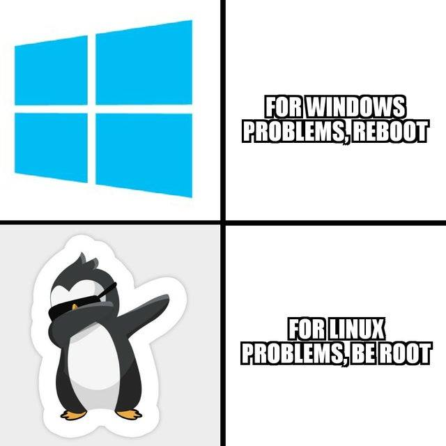

# B1 Linux 2022

Ici seront déposés tous les supports de cours liés au cours Linux 1ère année 2022.

### ➜ [**Cours**](./cours/README.md)

- [Intro Linux](./cours/intro/README.md)
- [Processus](./cours/processus/README.md)
- [Permissions](./cours/permissions/README.md)
- [Shell](./cours/shell/README.md)
- [Scripting](./cours/scripting/README.md)
- [Partitionnement](./cours/partition/README.md)
- [FHS](./cours/fhs/README.md)
- [Paquets](./cours/paquets/README.md)

### ➜ [**Memos**](./cours/memos/)

- [Mémo commandes Linux](./cours/memos/commandes.md)
- [Mémo réseau Rocky](./cours/memos/rocky_network.md)
- [Mémo LVM](./cours/memos/lvm.md)
- [QUAND TON SSH MARCHE PAS](./cours/memos/kansshmarchpa.md)

### ➜ [**TP**](./tp/README.md)

- [TP1 : Are you dead yet ?](./tp/1/README.md)
- [TP2 : Appréhender l'environnement Linux](./tp/2/README.md)
- [TP3 : We do a little scripting](./tp/3/README.md)
- [TP4 : Stockage et Serveur Web](./tp/4/README.md)
- [TP5 : Self-hosted Cloud](./tp/5/README.md)
- [TP6 : Travail autour de la solution NextCloud](./tp/6/README.md)

