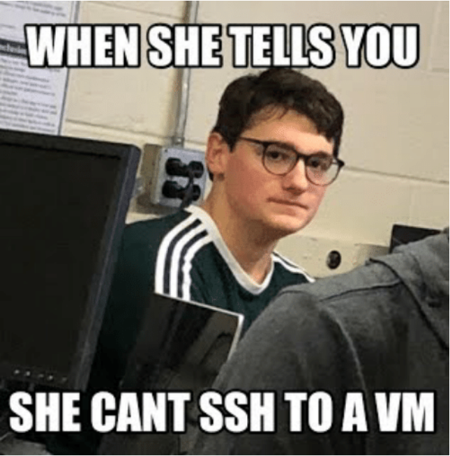

# QUAND TON SSH MARCHE PAS

**Alors avant de m'appeler, vous faites un ptit check de ce document.**

Le nécessaire pour que vous puissiez vous connecter en SSH à une VM, **je donne le détail de chaque point dans la suite du doc** :

- la VM doit avoir une interface Host-Only (VirtualBox)
- votre PC a une IP dans ce réseau Host-Only
- la VM a une IP sur sa carte Host-Only
- la VM et le PC doivent être dans le même réseau
- le service SSH doit être actif dans la VM
- le service SSH doit écouter sur un port connu (`22/tcp` par convention)

## 0. Sommaire

- [QUAND TON SSH MARCHE PAS](#quand-ton-ssh-marche-pas)
  - [0. Sommaire](#0-sommaire)
  - [1. Vérifier l'interface Host-Only dans VBox](#1-vérifier-linterface-host-only-dans-vbox)
  - [2. Repérer l'IP de votre PC dans le réseau Host-Only](#2-repérer-lip-de-votre-pc-dans-le-réseau-host-only)
  - [3. Repérer l'IP de la VM dans le réseau Host-Only](#3-repérer-lip-de-la-vm-dans-le-réseau-host-only)
  - [4. Vérifier que les deux IPs sont dans le même réseau](#4-vérifier-que-les-deux-ips-sont-dans-le-même-réseau)
  - [5. Vérifier que le service SSH est actif dans la VM](#5-vérifier-que-le-service-ssh-est-actif-dans-la-vm)
  - [6. Vérifier que SSH écoute sur un port connu](#6-vérifier-que-ssh-écoute-sur-un-port-connu)

## 1. Vérifier l'interface Host-Only dans VBox

**Dans l'interface de VirtualBox, vérifiez que votre VM a bien une carte Host-Only.**

Vous pouvez lui en ajouter une si ce n'est pas le cas en allant dans les paramètres de la VM.

## 2. Repérer l'IP de votre PC dans le réseau Host-Only

**Dans l'interface de VirtualBox : allez dans la configurtion des Host-Only et vérifier l'IP que vous avez choisie pour cette carte.**

- vous ne pouvez pas choisir ni la première ni la dernière adresse d'un réseau donné
- par exemple `10.105.1.0/24` et `10.105.1.255/24` ne sont pas utilisables : ce sont l'adresse de réseau et l'adresse de broadcast

## 3. Repérer l'IP de la VM dans le réseau Host-Only

**Dans la VM, faites un `ip a` et vérifier que votre carte Host-Only une IP.**

Pour affecter une IP statique à une machine Rocky, référez-vous au [mémo réseau](./rocky_network.md).

- vous ne pouvez pas choisir ni la première ni la dernière adresse d'un réseau donné
- par exemple `10.105.1.0/24` et `10.105.1.255/24` ne sont pas utilisables : ce sont l'adresse de réseau et l'adresse de broadcast

Pour rappel, dans votre VM, les interfaces sont dans le même ordre que dans l'interface de VBox.

Ainsi, si vous avez mis une carte NAT dans le premier slot, et une carte Host-Only dans le deuxième, alors la première carte `enp0s3` c'est la NAT, et `enp0s8` la Host-Only.

## 4. Vérifier que les deux IPs sont dans le même réseau

Pour ça, il faut se remémorer les cours de réseau, que je vais pas redétailler ici, je vous invite à les reconsulter si nécessaire.

**Les deux adresses IP qu'on a repéré doivent être dans le même réseau.**

Un cas simple pour un réseau, c'est avec un masque `/24` (aussi noté `255.255.255.0`). Dans le cas d'un `/24`, on dit que deux IPs sont dans le même réseau, si leurs trois premiers octets sont identiques.

Par exemple, pour qu'une machine soit dans le même réseau qu'une deuxième machine, et on sait que cette deuxième machine porte l'IP `10.3.2.10/24` alors on peut choisir n'importe quelle IP qui commence par `10.3.2.` SAUF :

- l'adresse de réseau, dans notre exemple c'est `10.3.2.0`
- l'adresse de broadcast, dans notre exemple c'est `10.3.2.255`
- l'adresse des machines déjà présentes dans le réseau, ici on a la deuxième machine qui est en `10.3.2.10`

N'importe quelle autre IP qui commence par `10.3.2.` fera donc l'affaire.

## 5. Vérifier que le service SSH est actif dans la VM

**Exécutez un `systemctl status sshd` dans la VM pour obtenir l'état du service SSH.**

> Le nom du service c'est `sshd` pour les bases RedHat, `ssh` pour les bases Debian.

## 6. Vérifier que SSH écoute sur un port connu

**Exécutez un `sudo ss -alntp` dans la VM et constatez que le programme `sshd` écoute bien derrière un port, normalement `22/tcp` par convention.**

Vérifiez aussi que ce port est bien ouvert dans votre firewall. Référez-vous là encore au [mémo réseau](./rocky_network.md) pour les interactions avec le firewall.
