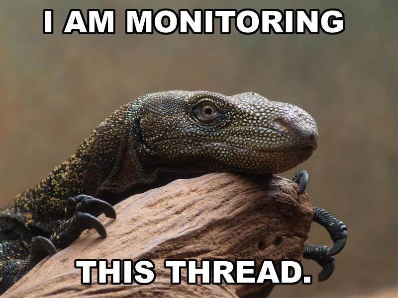

# Module 4 : Monitoring

Dans ce sujet on va installer un outil plutôt clé en main pour mettre en place un monitoring simple de nos machines.

L'outil qu'on va utiliser est [Netdata](https://learn.netdata.cloud/docs/agent/packaging/installer/methods/kickstart).

🌞 **Installer Netdata**

- je vous laisse suivre la doc pour le mettre en place [ou ce genre de lien](https://wiki.crowncloud.net/?How_to_Install_Netdata_on_Rocky_Linux_9)
- vous n'avez PAS besoin d'utiliser le "Netdata Cloud" machin truc. Faites simplement une install locale.
- installez-le sur `web.tp6.linux` et `db.tp6.linux`.

➜ **Une fois en place**, Netdata déploie une interface un Web pour avoir moult stats en temps réel, utilisez une commande `ss` pour repérer sur quel port il tourne.

Utilisez votre navigateur pour visiter l'interface web de Netdata `http://<IP_VM>:<PORT_NETDATA>`.

🌞 **Une fois Netdata installé et fonctionnel, déterminer :**

- l'utilisateur sous lequel tourne le(s) processus Netdata
- si Netdata écoute sur des ports
- comment sont consultables les logs de Netdata

➜ **Vous ne devez PAS utiliser le "Cloud Netdata"**

- lorsque vous accéder à l'interface web de Netdata :
  - vous NE DEVEZ PAS être sur une URL `netdata.cloud`
  - vous DEVEZ visiter l'interface en saisissant l'IP de votre serveur
- l'interface Web tourne surle port 19999 par défaut

🌞 **Configurer Netdata pour qu'il vous envoie des alertes** 

- dans [un salon Discord](https://learn.netdata.cloud/docs/agent/health/notifications/discord) dédié en cas de soucis

🌞 **Vérifier que les alertes fonctionnent**

- en surchargeant volontairement la machine 
- par exemple, effectuez des *stress tests* de RAM et CPU, ou remplissez le disque volontairement
- demandez au grand Internet comme on peut "stress" une machine (c'est le terme technique)

